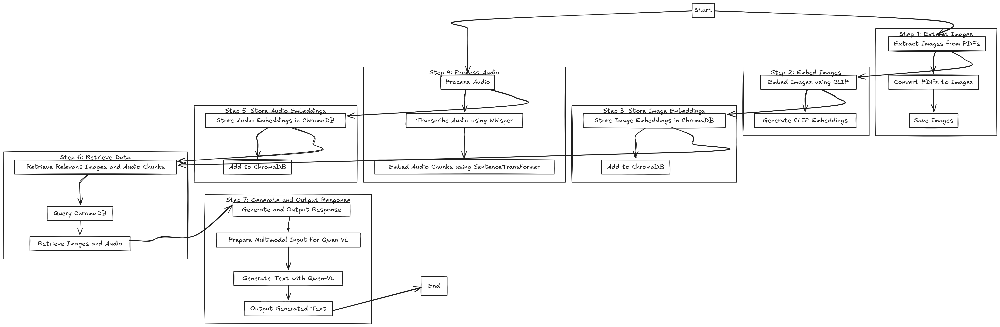

# Multimodal RAG Pipeline with CLIP, Whisper, and Qwen-VL

This repository contains a **Multimodal Retrieval-Augmented Generation (RAG) Pipeline** that integrates **images**, **audio**, and **text** for advanced multimodal querying and response generation. The pipeline uses **CLIP** for image embeddings, **Whisper** for audio transcription, **SentenceTransformer** for text embeddings, **ChromaDB** for vector storage, and **Qwen-VL** for multimodal text generation.

---

## Features

- **PDF to Image Conversion**: Extracts images from PDFs for processing.
- **Image Embedding with CLIP**: Generates embeddings for images using the CLIP model.
- **Audio Transcription with Whisper**: Transcribes audio files into text chunks.
- **Text Embedding with SentenceTransformer**: Generates embeddings for transcribed audio chunks.
- **Vector Storage with ChromaDB**: Stores and retrieves embeddings for images and audio.
- **Multimodal Querying**: Retrieves relevant images and audio chunks based on a user query.
- **Multimodal Text Generation with Qwen-VL**: Generates text responses using retrieved images, audio, and the query.
- **Image and Text Output**: Displays retrieved images and generated text.

---

## Pipeline Overview

1. **Extract Images from PDFs**: Convert PDFs into images and save them.
2. **Embed Images using CLIP**: Generate embeddings for the extracted images.
3. **Store Image Embeddings in ChromaDB**: Store the embeddings in a ChromaDB collection.
4. **Process Audio**: Transcribe audio files and generate embeddings for the text chunks.
5. **Store Audio Embeddings in ChromaDB**: Store the embeddings in a ChromaDB collection.
6. **Retrieve Relevant Data**: Query ChromaDB to retrieve relevant images and audio chunks.
7. **Display Retrieved Images**: Display the retrieved images to the user.
8. **Prepare Multimodal Input for Qwen-VL**: Combine retrieved images, audio, and the query.
9. **Generate Text with Qwen-VL**: Generate a text response using Qwen-VL.
10. **Output Generated Text**: Display the final generated text.

---

### Prerequisites
- Python 3.8 or higher
- GPU (recommended for faster processing)

---

### Dependencies
- pdf2image: For converting PDFs to images.
- Pillow: For image processing.
- transformers: For CLIP, Whisper, and Qwen-VL models.
- sentence-transformers: For text embeddings.
- chromadb: For vector storage and retrieval.
- librosa: For audio processing.
- torch: For deep learning operations.
